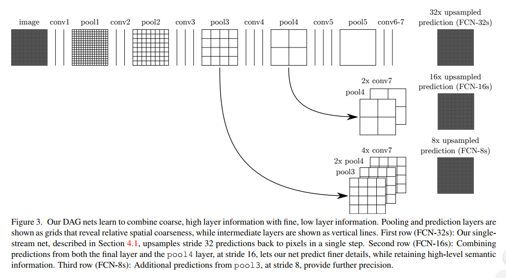
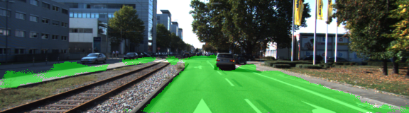

# Semantic Segmentation
### Introduction
The goal of this project is to label the pixels of a road in images using a Fully Convolutional Network (FCN). The FCN paper can be found [here](https://people.eecs.berkeley.edu/~jonlong/long_shelhamer_fcn.pdf). 

My personal understanding is that FCN employs the CNN classification architecture for the first half of its pipeline, then it leverages mid-layers information (here VGG layer 3/4/7) to "deconvolution" into full/original resolution of segmentation/classification at single pixel level. It reminds me the decoder-encoder structure of GAN. 

To shrink down the number of parameters, it dumps the fully connected layer in traditional CNN, instead using 1x1 convolutions to keep spatial information which is key for segmentation. 


### Setup
##### Frameworks and Packages
Make sure you have the following is installed:
 - [Python 3](https://www.python.org/)
 - [TensorFlow](https://www.tensorflow.org/)
 - [NumPy](http://www.numpy.org/)
 - [SciPy](https://www.scipy.org/)
##### Dataset
Download the [Kitti Road dataset](http://www.cvlibs.net/datasets/kitti/eval_road.php) from [here](http://www.cvlibs.net/download.php?file=data_road.zip).  Extract the dataset in the `data` folder.  This will create the folder `data_road` with all the training a test images.

### Implement
Reused the VGG network, pulling out the layer 3/4/7 and follow the FCN paper to do the FCN-8. 


### Run
Run the following command to run the project:
```
python main.py
```

#### Tuning
* Started with EPOCHS = 20, DROPOUT=0.75 and BATCH_SIZE=3. The process finished running on my GTX1070 GPU in around 8 min. 
The loss decreasing log example:
```
teration:  1  current loss: 56.13
iteration:  2  current loss: 43.8245
iteration:  3  current loss: 28.7274
iteration:  4  current loss: 24.8137
iteration:  5  current loss: 24.4434
iteration:  6  current loss: 22.2354
iteration:  7  current loss: 16.3863
iteration:  8  current loss: 13.5209
iteration:  9  current loss: 14.3004
iteration:  10  current loss: 11.1948
iteration:  11  current loss: 11.1992
iteration:  12  current loss: 10.7507
iteration:  13  current loss: 8.60057
iteration:  14  current loss: 7.74501
iteration:  15  current loss: 6.30506
iteration:  16  current loss: 6.66602
iteration:  17  current loss: 5.52847
iteration:  18  current loss: 5.79155
iteration:  19  current loss: 5.04073
iteration:  20  current loss: 4.3875
...
```

* Changed setting to EPOCHS=30, DROPOUT=0.5 and BATCH_SIZE=1 got me better result. I ended up submitting this version. 
```
iteration:  287  current loss: 0.0640475
iteration:  288  current loss: 0.0174277
iteration:  289  current loss: 0.0242532
epoch:  30  of  30 training loss:  0.0274393789883
```
A sample segmentation image: 

